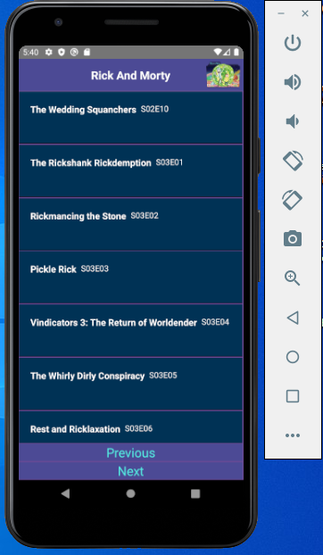

# Rick-And-Morty-API-React-Native
Episode List , Character List , Character Details

## How to use App ?

Start terminal and use these commands sequentially

`cd .\RickandMorty\ and npx react-native start`

After that new Start terminal and use these commands sequentially 

`cd .\RickandMorty\ npx react-native run-android`

## App Screenshots 

